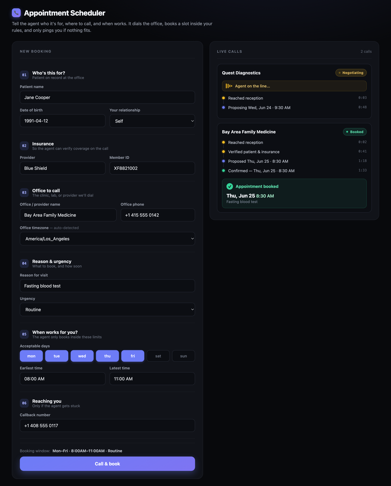

# Appointment Scheduler — an AI voice agent that books medical appointments by phone

[](https://github.com/kumarabishek/appointment-scheduler/actions/workflows/ci.yml)

An AI agent that **calls a doctor's office on your behalf**, navigates the phone
tree, waits on hold, talks to the receptionist, and **books an appointment that
fits your rules** — all in a single phone call. Built for the "spent 40 minutes
on hold" problem.

You fill in who it's for, where to call, and when works. The agent dials out,
handles the conversation live, and books a slot inside your pre-set window —
only pinging you if nothing fits.



> **Note for reviewers:** the live app is gated behind sign-in (it handles
> patient data), so this README is the best way to see what it does. The
> screenshot above is the real UI; the architecture and code are below.

---

## What it actually does

1. You submit a booking request (patient, office, reason, acceptable days/times).
2. The agent places a real outbound call via [Vapi](https://vapi.ai) (telephony + voice).
3. It **navigates the office's IVR phone tree** by pressing touch-tone digits (DTMF),
   waits through hold music **without hanging up**, and talks to the operator.
4. When the office offers times, the agent books one that fits your window **on the
   spot**. If nothing fits, it pushes you a tap-to-approve notification and holds
   the line for your answer.
5. The booking lands on your calendar; the dashboard streams each call's status live.

## Highlights

- 🎙️ **Real telephony, end-to-end** — outbound calls, **multi-level IVR navigation
  via DTMF**, hold-queue handling, and a live conversation with a human operator.
  Proven against a real phone tree (presses `1 → 2 → 1`, holds, then books).
- 🧠 **LLM agent with tools** — Google Gemini drives the call through a set of
  function tools (`dtmf`, `decide_and_book`, `finalize_booking`, `get_patient_details`,
  `escalate_to_human`). Listen-first turn-taking so it never talks over the menu.
- 🔐 **Security & privacy by design** (medical data):
  - **Clerk** authentication; every API route is auth-gated.
  - **Per-user data isolation** — users only ever see their own bookings.
  - **AES-256-GCM encryption at rest** for the *entire* call record (PHI).
  - **Data minimization** — DOB/insurance are kept out of the LLM prompt and fetched
    just-in-time, only when the office asks.
  - Vapi **HIPAA mode** (no stored recordings/transcripts), fail-closed webhook
    auth, per-user daily rate limit, and a `no-console` lint guard so PHI can't
    leak into logs.
- ⚡ **Serverless-ready** — Next.js App Router on Vercel, Postgres (Neon) via Prisma.

## Architecture

```
 Browser (Next.js UI, Clerk auth)
        │  POST /api/requests
        ▼
 Next API (Vercel) ──places call──▶  Vapi  ──▶  Gemini (agent)  +  Deepgram (STT)  +  ElevenLabs (TTS)
        │                                            │
        │  ◀────── tool calls (webhook) ─────────────┘
        ▼            dtmf · decide_and_book · finalize_booking · get_patient_details
 Postgres (Neon, Prisma)            │
   call records, encrypted at rest  ▼
                          Books a fitting slot live, or pushes
                          you a tap-to-approve and holds the line
```

| Concern | Tech |
|---|---|
| Web app + API | Next.js 15 (App Router), React 19, TypeScript |
| Telephony + voice orchestration | Vapi |
| LLM (the agent's reasoning) | Google Gemini 2.5 Flash |
| Speech-to-text / text-to-speech | Deepgram / ElevenLabs |
| Auth | Clerk |
| Database | Postgres (Neon) + Prisma |
| Hosting | Vercel (serverless) |
| Calendar | Google Calendar API, with an `.ics` fallback |

## How the hard parts work

**IVR navigation.** Offices answer with recorded menus ("press 1 for scheduling").
The agent is configured *listen-first* so it doesn't talk over the menu, then uses
Vapi's native DTMF tool to press digits — waiting for the full menu and inserting
pauses between keys so the tones register. It treats hold music as "stay silent and
wait," and only re-engages when a human greets it.

**Hybrid auto-booking.** You set acceptable windows up front. If the office offers a
slot inside them, the agent books immediately (the common path). If not, the server
pushes a tap-to-approve notification and the agent holds the line for your decision —
no second call.

**PHI handling.** The whole call record is encrypted at rest; API responses are
display-only DTOs (no DOB/insurance/callback over the wire); the most sensitive
identifiers never enter the LLM prompt and are fetched just-in-time only when the
office asks to verify.

## Repository layout

```
web/                     # the Next.js application
  src/app/               # UI (page.tsx) + API routes (requests, calls, decide, webhooks)
  src/lib/               # agent prompt + tools, Vapi client, store (Prisma), crypto, booking logic
  prisma/                # schema + migrations
docs/screenshot.png      # the UI shown above
.github/workflows/ci.yml # lint + typecheck + tests + build on every push
```

See [`web/README.md`](web/README.md) for full local setup and environment variables.

## Running it locally

```bash
cd web
npm install
cp .env.example .env.local   # fill in Vapi, Clerk, Neon, and the model keys
npx prisma migrate dev       # create the database tables
npm run dev                  # http://localhost:8000
```

---

*A learning project exploring voice AI, real-world telephony, and privacy-conscious
engineering. Not a HIPAA-certified product — see the security notes in the code.*
